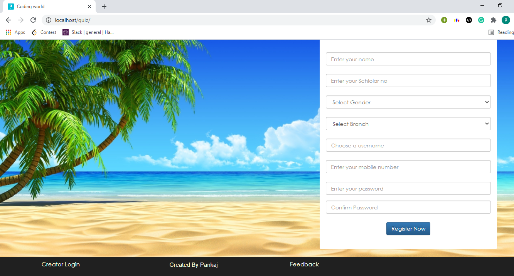
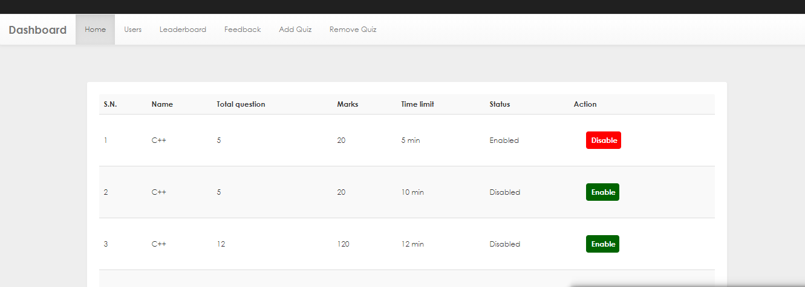
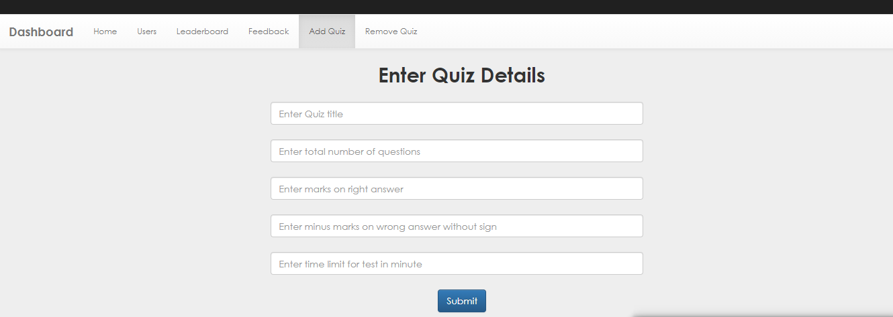
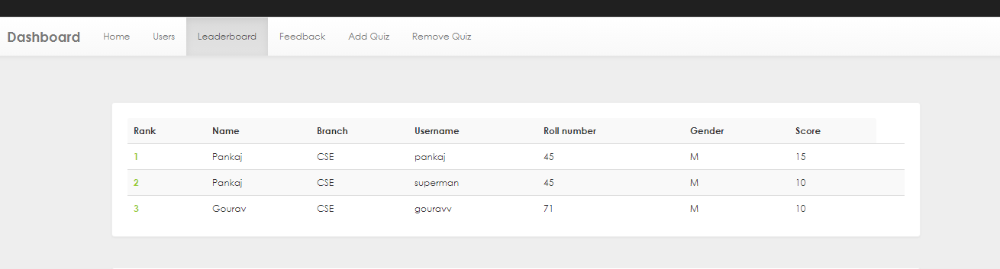
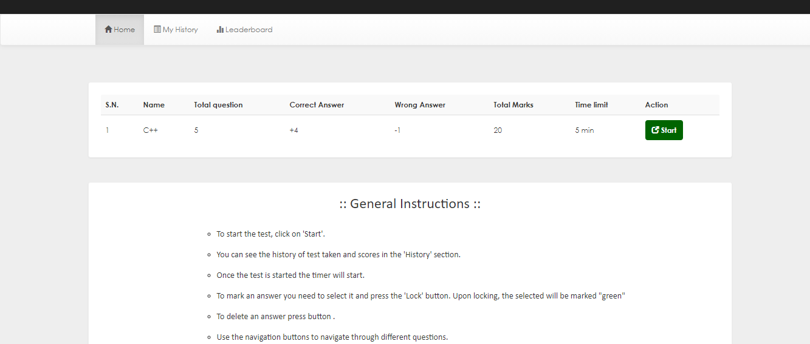
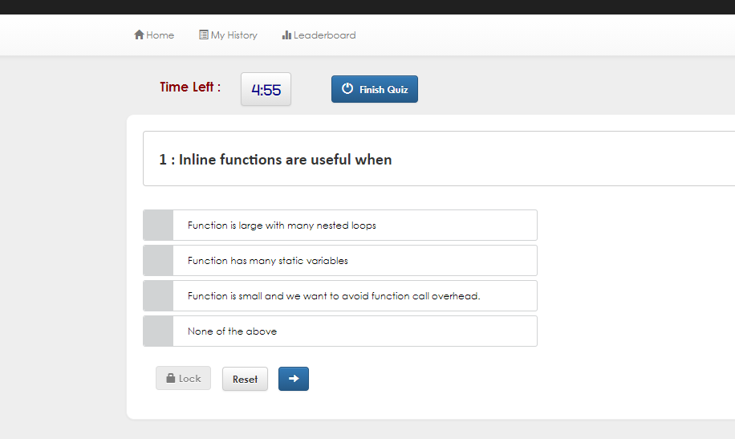
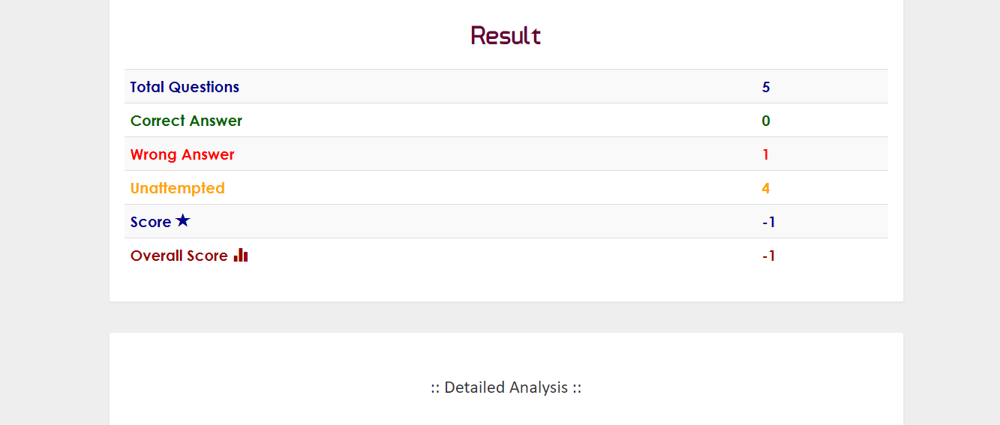

# About

An online quiz web app built using on PHP, Javascript, HTML, CSS and MySQL. 

# Features: 

1. Add questions of quiz using admin panel.
2. Use "Enable" and "Disable" button to enable and disable the quiz on the Admin panel.
3. Supports MCQ type questions only.
4. Supports timer for quiz.
5. Supports Leadorboard.
6. User need to answer the given questions in given time.
7. User can view results of quizzes that he has taken.

# Demo 

Homepage : 

Admin panel : 

Add Quiz : 

leaderboard : 

Instructions : 

Timer : 

Result : 

